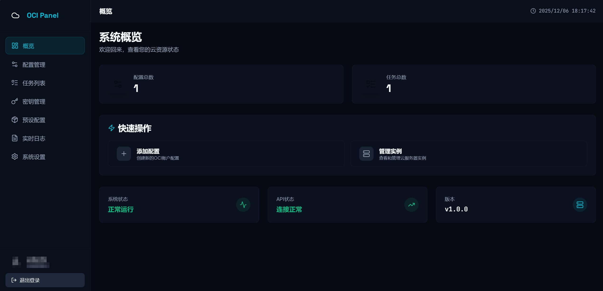
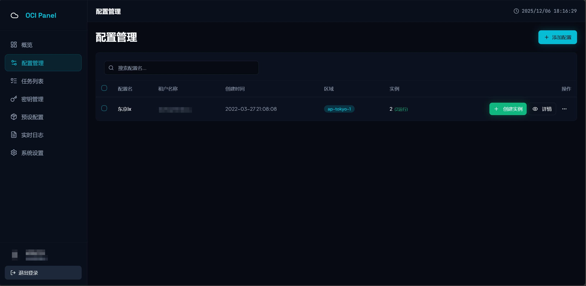
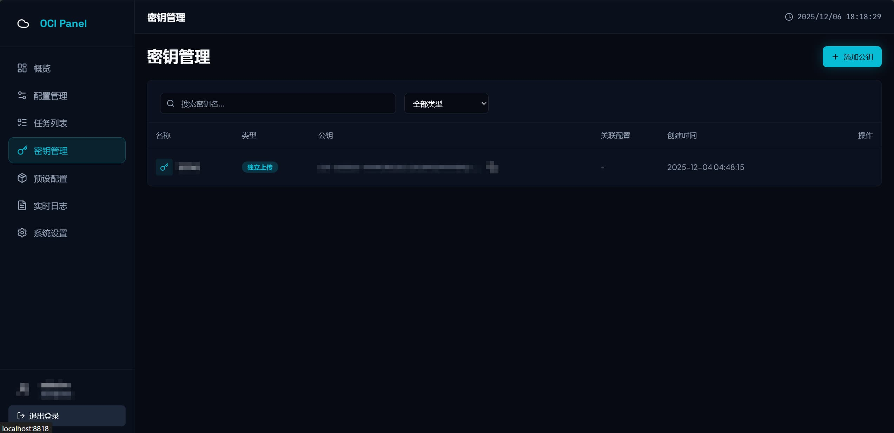
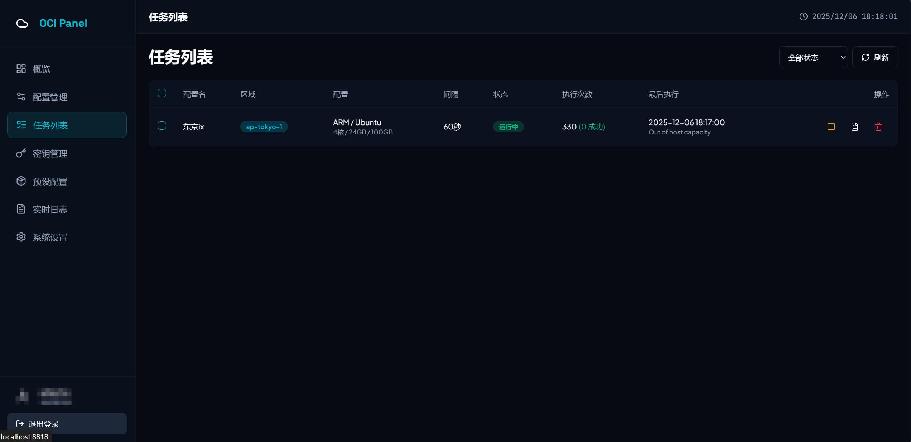
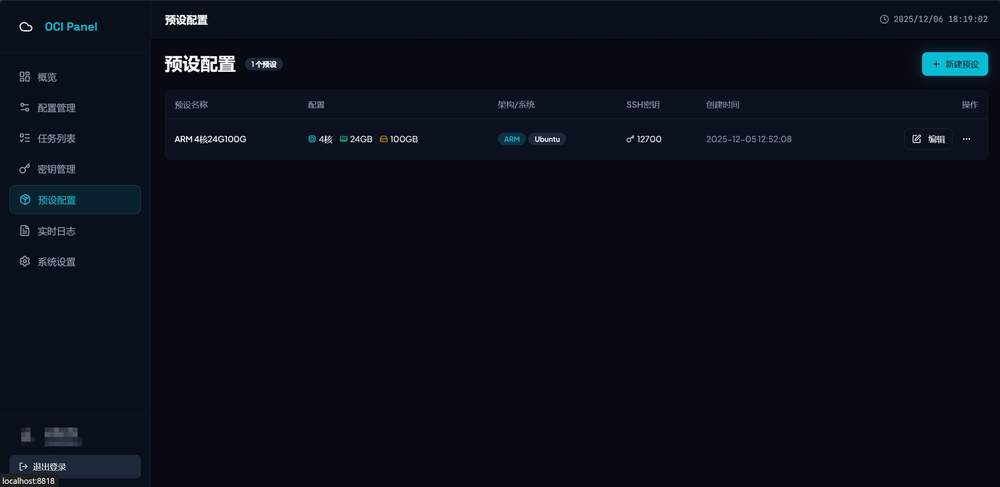
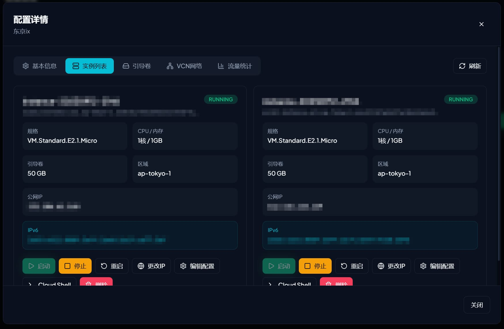

# OCI Panel

一个功能强大的 Oracle Cloud Infrastructure (OCI) 管理面板，提供实例管理、自动抢机、密钥管理等功能。

## 功能特性

- **实例管理** - 查看、创建、启动、停止、重启实例
- **自动抢机** - 支持定时任务自动创建实例
- **密钥管理** - 管理 OCI API 密钥配置
- **预设配置** - 保存常用实例配置模板
- **Telegram 通知** - 支持 Telegram Bot 消息推送
- **流量统计** - 实例流量监控与统计
- **安全组管理** - 管理实例安全规则
- **IP 管理** - 公网 IP 分配与管理

## 截图预览

### 仪表盘


### 配置管理


### 密钥配置


### 任务管理


### 预设配置


### 实例设置


## 技术栈

### 后端
- Go
- Gin Web Framework
- SQLite

### 前端
- Vue 3
- TypeScript
- Tailwind CSS
- Vite

## 快速开始

### 环境要求

- Go 1.24+
- Node.js 18+

### 配置

复制配置文件并修改：

```bash
cp config.toml.example config.toml
```

配置示例：

```toml
[server]
port = "8999"

[web]
account = "admin"
password = "admin"

[database]
dsn = "oci-helper.db"

[logging]
level = "info"
```

### 构建运行

**Linux/macOS:**

```bash
./build.sh
./oci-panel
```

**Windows:**

```bash
build.bat
oci-panel.exe
```

### 访问面板

启动后访问 `http://localhost:8999`，使用配置文件中的账号密码登录。

## 开发

### 前端开发

```bash
cd frontend
npm install
npm run dev
```

### 后端开发

```bash
go run main.go
```

## License

[LICENSE](./LICENSE)
